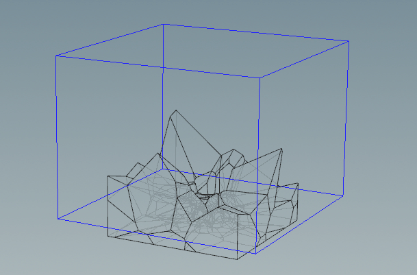

Various houdini example hip files for personal sutdy.

***

# BulletPhysics

## fracture_rbd_sleeping.hip

Use `RBD Config` and `Point Velocity` to create a separated force field.

## fracture_collision_group.hip

Use `RBD config` to create `Collision Group` to ignore specified primitives.

# Fracture

## boolean_fracture.hip

Use two `boolean` to split geometry seamlessly.  

## delete_pieces_by_bounding.hip

Delete fracture pieces by bounding box.  

# Mantra

## camera_follow_path_lookat.hip

Camera look at target alone path.
